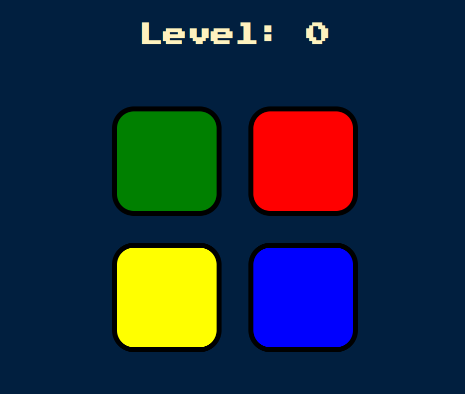

# Simon Game

Welcome to Simon, a classic memory and pattern recognition game implemented in JavaScript!

## Simon Game

### Description
Simon is a memory and pattern recognition game where the player must repeat a sequence of colors and sounds generated by the game. The game starts with a simple pattern and becomes progressively more challenging as the player advances through levels. The goal is to see how far you can go without making a mistake.

### Features
- Randomly generates a sequence of colors and sounds for the player to repeat.
- Keeps track of the player's progress with levels.
- Provides audio and visual feedback for correct and incorrect sequences.

**Note:** The game currently runs in the browser, and it's built using HTML, CSS, and JavaScript.

### Motivation
This project was developed with the goal of practicing and enhancing programming skills, particularly in areas such as event handling, animation, and game logic. Implementing Simon's gameplay involves handling various conditions, making it a valuable exercise for problem-solving and logic-building while also getting more familiar with the JavaScript language. 

Also, this project was developed as a challenge from Angela Yu's Web Development Bootcamp.
The course can be found [HERE](https://www.udemy.com/course/the-complete-web-development-bootcamp/)
